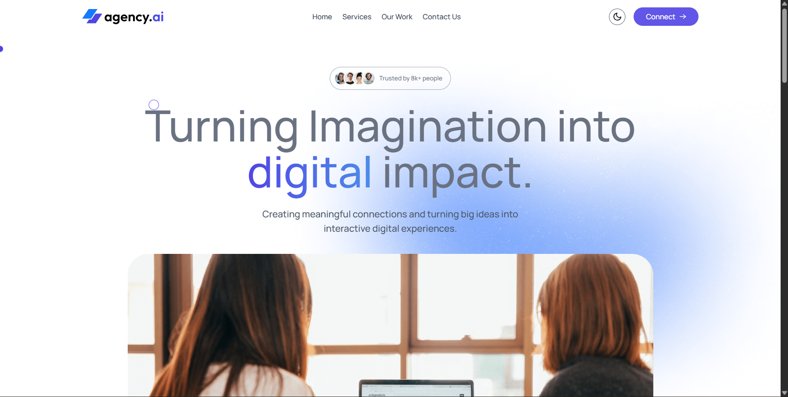
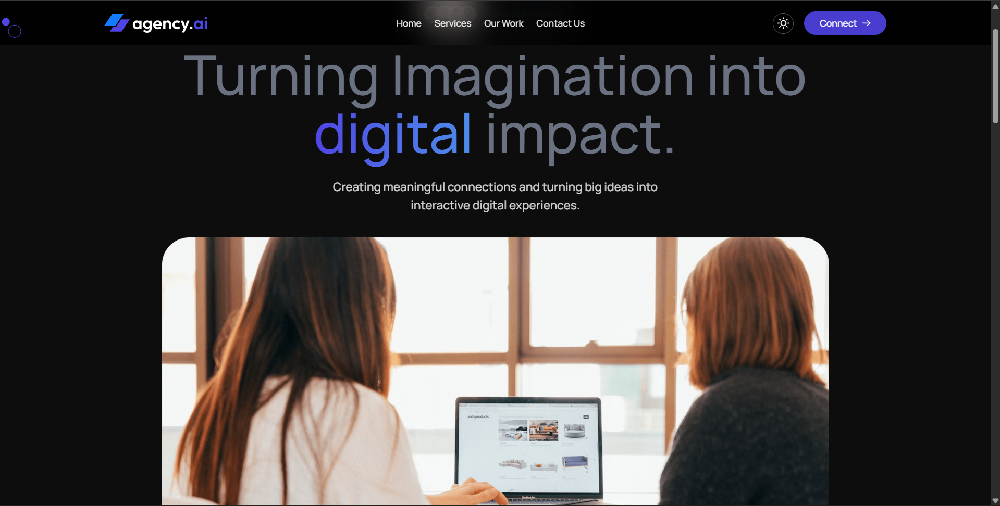
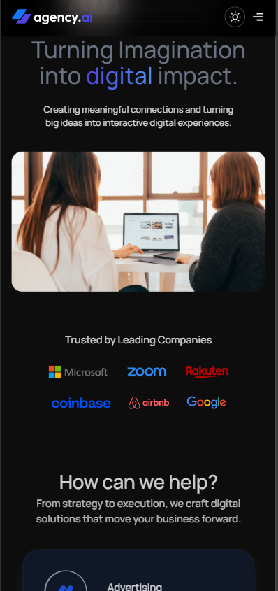

# 🌐 Agency UI - Modern Responsive Website

A fully responsive **Agency Website UI**. This site can be used with any agency related work, which is ready to work and run, built with **React, TailwindCSS, and Framer Motion**, featuring **dark/light mode theme switching**, smooth animations, and a **working contact form powered by Web3Forms**.  

🚀 **Live Site** → [Agency UI](https://agency-ui-three.vercel.app/)

---

## ✨ Features

- 🎨 **Modern UI/UX Design**  
- 📱 **Fully Responsive** – Optimized for **mobile, tablets, and large screens**  
- 🌗 **Dark/Light Theme Toggle**  
- 🎬 **Framer Motion Animations** – Smooth transitions & interactive effects  
- 📩 **Functional Contact Form** – Integrated with [Web3Forms](https://web3forms.com) to send messages directly  
- ⚡ **Fast & Optimized** – Built with **Vite** + TailwindCSS  
- 🛠️ **Reusable Components** – Navbar, Hero, Services, Our Work, and Contact  

---
## 🌗 Theme Toggle (Dark/Light Mode)

- Implemented using Tailwind’s dark variant
- Users can switch between light 🌞 and dark 🌙 modes seamlessly
  
## 🖼️ Screenshots

### 🌞 Light Mode  


### 🌙 Dark Mode  


### 📱 Mobile Responsive  


---

## 🛠️ Tech Stack

- **Frontend:** React.js, Vite  
- **Styling:** TailwindCSS  
- **Animations:** Framer Motion  
- **Forms:** Web3Forms API  
- **Deployment:** Vercel  

---

## 🚀 Getting Started

Follow these steps to run the project locally:

### 1. Clone the repository
```bash
git clone https://github.com/your-username/agency-ui.git
cd agency-ui

npm install
npm run dev

WEB3FORMS
This project uses Web3Forms for sending messages via the contact form.
Create an account on Web3Forms
Get your Access Key -> 
<input type="hidden" name="access_key" value="YOUR_ACCESS_KEY" />

```
---
## 📬 Contact  

This project includes a fully functional **Contact Form** powered by [Web3Forms](https://web3forms.com/).  
Visitors can send me messages directly through the form, and i’ll receive them via email instantly.  
---

## 👨‍💻 Author  
Made with ❤️ by **Rounak**  
